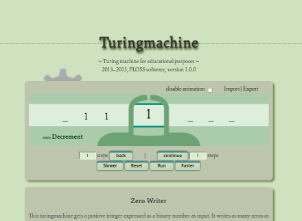

turingmachine.js
================

:release:   1.0.1-chromium-fix
:date:      October 2013 - September 2015
:status:    hopefully stable
:author:    meisterluk
:license:   CC0

A turingmachine for educational purposes.

Installation
------------

Just open ``index.html`` in some modern browser.

Or even better: Run python::

    python -m SimpleHTTPServer

or in python3::

    python3 -m http.server

Then open the link provided by python for the local webserver.

Roadmap
-------

Unscheduled TODOs:

* fix TODOs (mainly state / symbol normalization)
* enable gear animation
* In Javascript, "new Program()", "new Tape()", … must be the default way to get a console TM
* Rename NumberVisualization.setNumbers to NumberVisualization.writeNumbersFast
* Number should be called "Value"
* JFLAP export
* some easter egg
* example program: a turingmachine implemented in a turingmachine
* feature: testcases with

  * less than x steps
  * exactly x steps
  * less than n steps
  * unknown_instruction occured?
  * halt occured?
  * some value was written?
  * the last value written is ...
  * movement X has been done

1.4.0 release
~~~~~~~~~~~~~

* instruction graph with springy.js

1.1.0 release
~~~~~~~~~~~~~

* Basic interaction with tape
  Clicking on left/right side moves tape there
* Busy beaver example program

1.0.0 release
~~~~~~~~~~~~~

* stable visualization
* additional loadable example programs

  - 4-bit addition

0.9.9 release
~~~~~~~~~~~~~

* Refactor tape representation - use tape values stripped by default_value and cursor position.
* Simplify Turingmachine implementation.
* Refactor event handling of AnimatedTuringmachine.
* Provide a button to easily copy the last line of the transition table.

cheers,
meisterluk
